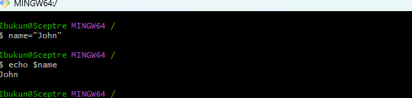
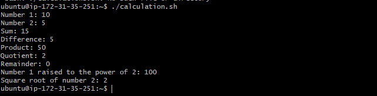
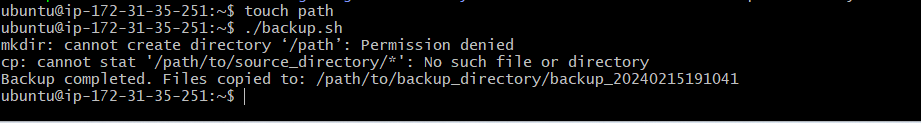

# Shell-Scripting-
## Shell scripting Hands on project

### 1.	What is shell scripting
### 2.	Introduction to shell scripting
### 3.	Importance of shell scripting
### 4.	Targeted Audience
### 5.	Prerequisite
### 6.	Goal to be accomplished by the end of shell scripting

## What is shell scripting
### A shell script is a text file containing a list of commands that instruct an operating system to perform specific tasks. The shell (an interface) interprets, processes, and executes these commands from the script.

## Introduction to a shell scripting 
### Shell scripting is a powerful tool commonly used across industries to automate tasks, test solutions, and increase efficiency. Let’s explore the basics of shell scripting:

### A shell program, sometimes referred to as a shell script1, is simply a program constructed of shell commands. Shell programs are interpreted each time they are run. This means each command is processed (i.e. executed) by the shell a single line at a time. This is different from languages such as C or C++, which are translated in their entirety by a compiler program into a binary image. A shell program may be simple and consist of just a few shell commands, or it may be very complex and consist of thousands2 of shell commands. The complexity of the shell program is in the hand of the programmer. In general, a shell program can be characterized by:

#### •	shell programs consist of one or more primitive shell commands
#### •	shell programs are created using your text editor of choice, e.g. vi or emacs
#### •	shell programs are executed just as shell commands are, by typing the name of the program followed by the [Enter] key
#### •	shell programs have permission modes as do any other file, and must have the correct permissions set to execute the program
#### •	as with other programming languages, the shell language has the functionality to allow input & output, iteration, logical decision making, file creation and deletion, and system call capability
#### •	shell programs are free format, as long as the syntax of each shell command is correct. This means that blank lines, indentation and abundant whitespace can be used freely.

## Uses of shell scripting
###	Automating repetitive system tasks: Shell scripts are used for tasks like backing up files, monitoring system resources, and managing user accounts. By turning commands into a script, system administrators save time, increase accuracy, and simplify complex tasks.

## Importance of shell scripting
### Shell scripting is primarily used to automate repetitive system tasks, such as backing up files, monitoring system resources, and managing user accounts. By turning a series of commands into a script, system administrators can save time, increase accuracy, and simplify complex tasks.

### • Automation and Efficiency Shell scripting allows you to automate repetitive tasks. By writing a sequence of commands in a script, you can execute them without manual intervention. Automation saves time, increases accuracy, and simplifies complex operations.
### •Daily Tasks and Scheduling with shell scripts, you can perform daily tasks efficiently. For example, you can create a script to clean up log files, update software, or organize files. You can also schedule these scripts to run automatically at specific times using tools like cron jobs.
### •Customization and Flexibility  Shell scripts allow you to tailor commands to your specific needs. You can create custom solutions for your environment.Unlike graphical user interfaces (GUIs), which may have limitations, shell scripts provide full control over system operations.
### •Debugging and Troubleshooting: When issues arise, shell scripts help you diagnose problems. You can add debugging statements, check variables, and analyze output. Troubleshooting becomes easier with well-structured scripts
### •Cross-Platform Compatibility: hell scripts work across different platforms (Linux, Unix, macOS, etc.) as long as the shell interpreter is available.This portability ensures that your automation remains consistent across systems.
### •Learning Opportunity: Writing shell scripts is an excellent way to learn about system administration, programming, and command-line tools. Beginners can start with simple tasks and gradually build more complex scripts.

## Targeted Audience 
### Shell, as a global energy company, caters to a diverse audience. Let’s explore their target segments:

#### 1.	Business-to-Business (B2B):
#### 2.	Private and government institutions: These organizations deal with oil and gas energy products or related items worldwide 
#### Individual Consumers (B2C):
#### People: Shell provides petrol and diesel for vehicles and domestic use.
#### Enterprises: Enterprises seek energy for production and other operational needs.
####	Geographic Reach:
#### Shell’s products are in demand everywhere, so they concentrate on geographies to distribute their offerings.

### Prerequisite
### Familiarity with the Unix/Linux command line and running simple commands.
### Familiarity with running commands with options (e.g. ls  l ) and combining several command-line options (e.g. ls  lR )
### Familiarity with the concept of Unix file permission

### Goal to be accomplished by the end of shell scripting

### Shell scripting is primarily used to automate repetitive system tasks, such as backing up files, monitoring system resources, and managing user accounts. By turning a series of commands into a script, system administrators can save time, increase accuracy, and simplify complex tasks.

### Bash is a great place to start. With the knowledge you'll gain from this series, you'll be well on your way to becoming a proficient Bash.

### Bash is a great place to start. With the knowledge you'll gain from this series, you'll be well on your way to becoming a proficient Bash.

## SYNTAX ELEMENT VARIABLES
### Assigning valeus to variables
#### Bash allow us to define and work with vatiables
 #### These variables can store data of various types such as numbers, strings and arrays
 #### We can use = as operators and variable name proceed by $

 
"input below code"
"name="John" 
 #### Our result is john

 #### It can be used to trieve values

"echo $name"
"Name = John"

"It can be use to control flow"

'#!/bin/bash"

# Example script to check if a number is positive, negative, or zero

"read -p "Enter a number: " num"

"if [ $num -gt 0 ]; then
    echo "The number is positive."
elif [ $num -lt 0 ]; then
    echo "The number is negative."
else"
    echo "The number is zero."
fi"
 #### We will be instructed to input a data
"i input 5"

#### we have this result
#### The number is positive

### Iterating through a list using loop
#### copy below code

"#!/bin/bash"

# Example script to print numbers from 1 to 5 using a for loop

"for (( i=1; i<=5; i++ ))
do
    echo $i
done"

1
2
3
4
5

## For command substitution we can use $()

"current_date=`date +%Y-%m-%d`
current_date=$(date +%Y-%m-%d)"

#### It can be used for input and output

"echo "Enter your name:"
"read name"
#### We will be propted to enter our name.

"echo "Hello World"
#### We have bello back
"Hello World"

"echo "hello world" > index.txt

"grep "pattern" < input.txt"
"Create input.txt with touch" command
 

"touch input.txt"
"Then run below code"
"grep "pattern" < input.txt"

"For functions"
Run below code 
"echo "hello world" | grep "pattern"

"#!/bin/bash"

# Define a function to greet the user
"greet() {
    "echo "Hello, $1! Nice to meet you."
}

# "Call the greet function and pass the name as an argument"
"greet "John""
"it came out with" 
"Hello, John! Nice to meet you."

"#!/bin/bash"

# Prompt the user for their name
"echo "Enter your name:"
"read name"
"Enter below code"

# "Display a greeting with the entered name"
"echo "Hello, $name! Nice to meet you."
"we have below"
"Hello, Ibukun! Nice to meet you."

### Lets write our first scripting

"Safe input.sh file'

"Run' 
"sudo chmod +x user-input.sh"     
"Then run the script command of ./user-iput.sh"

"open vi user-input"
"Press i to edit, escape, press" "wq! then ente"

## Direct Manipulation and Navigation
#### In directory and manipulation, we will write shell scripting by following below
 steps

 #### 1. Open a file call navigating-linux-filesystem.sh
 #### 2. Paste below code inside the file created
#### 3. Run below code
#### sudo chmod +x navigating-linux-filesystem.sh
#### 4. Run the scrip on
"./navigating-linux-filesystem.sh"

## File operation and Sorting

### Create a file 1 to 3

#### Create a file by touch sorting.sh
Open a file with vi sorting.sh 
Save below code

'#!/bin/bash"

###  Create three files
echo "Creating files..."
echo "This is file3." > file3.txt
echo "This is file1." > file1.txt
echo "This is file2." > file2.txt
echo "Files created."

# Display the files in their current order
echo "Files in their current order:"
ls

# Sort the files alphabetically
echo "Sorting files alphabetically..."
ls | sort > sorted_files.txt
echo "Files sorted."

# Display the sorted files
echo "Sorted files:"
cat sorted_files.txt

# Remove the original files
echo "Removing original files..."
rm file1.txt file2.txt file3.txt
echo "Original files removed."

# Rename the sorted file to a more descriptive name
echo "Renaming sorted file..."
mv sorted_files.txt sorted_files_sorted_alphabetically.txt
echo "File renamed."

# Display the final sorted file
echo "Final sorted file:"
"cat sorted_files_sorted_alphabetically.txt"

#### Working with numbers and calculation
#### Script define 2 variables Numb 1 and Numb 2 with numeric value, perform basic arithmetics operation.(addition, bubstraction,multiplication, division and modules)
#### It also perform more complex calculations such as raising number 1 to the power of 2 and 
#### calculation and square root of a number and display those result 

#### Follow below steps
#### 1. create a file called calculation .sh with touch command
"touch calculation .sh"

#### Run below code

"#!/bin/bash"

# Define two variables with numeric values
"num1=10"
"num2=5"

# Perform basic arithmetic operations
"sum=$((num1 + num2))"
"difference=$((num1 - num2))"
"product=$((num1 * num2))"
"quotient=$((num1 / num2))"
"remainder=$((num1 % num2))"

# Display the results
"echo "Number 1: $num1"
"echo "Number 2: $num2"
"echo "Sum: $sum"
"echo "Difference: $difference"
"echo "Product: $product"
 "echo "Quotient: $quotient"
 "echo "Remainder: $remainder"

# Perform some more complex calculations
#### power_of_2=$((num1 ** 2))
#### square_root=$(echo "sqrt($num2)" | bc)

# Display the results
"echo "Number 1 raised to the ""power of 2: $power_of_2"
"echo "Square root of number 2:" "$square_root"

"vi calculation.sh'

#### 3 Execute permission on backup.sh

#### 4. Run a script and save above code in it

 #### File backup and time stamp
#### Shell scriping example is focusing on the file backup and timestamp
 #### Backing up database and other storage devises are the major role of a DevOps engineer.

  #### The script define the source directory and backup directory path.

  #### 1. One our terminal create a file called backup.sh
  #### with below code
  "touch backup.sh"

  #### 2. Copy the code below 

 ####  Run the script and save 
 " using vi backup.sh"

  #### 3. Execute permission calculation .sh .

#### 4. Run a script using a command ./backup.sh
 
#### With this we can see all our backup files.

